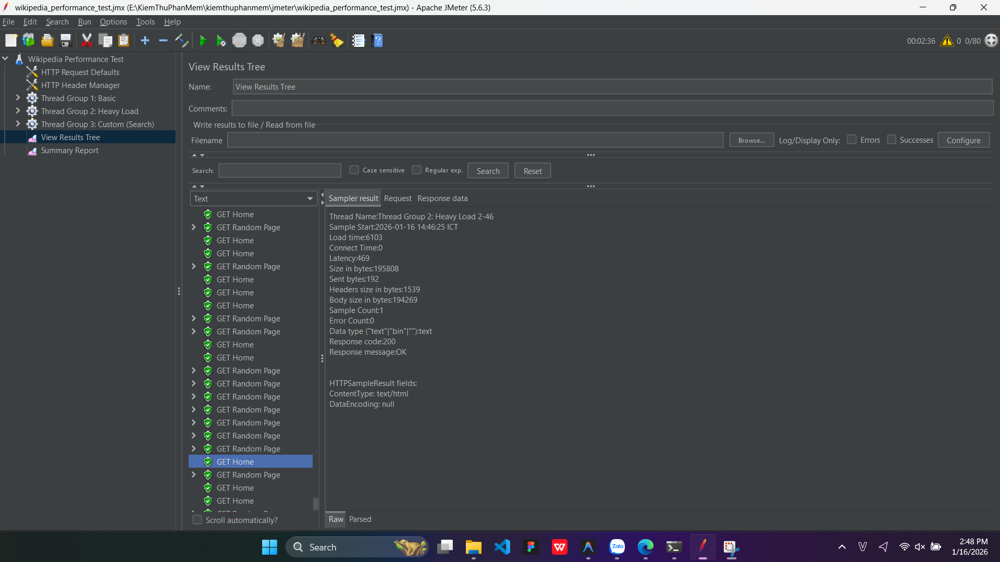
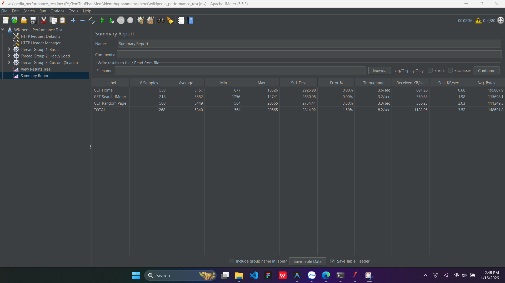
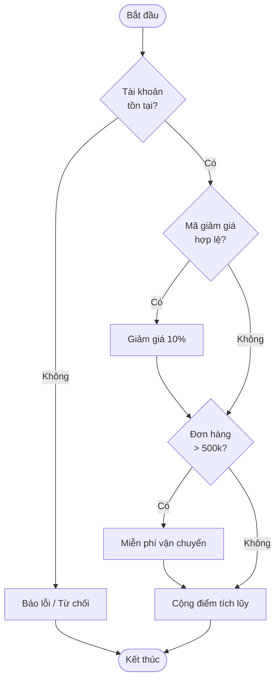

# Weekly Report – Software Testing

## Thông tin sinh viên
- **Họ và tên:** Nguyễn Đình Tuấn Anh
- **MSSV:** BCS230010

---

## Tuần 1
### Nội dung thực hiện
- [x] Hoàn thành Chương 1
- **Số điểm đạt được:** 6680

---

## Tuần 2
### Student Score Analyzer – Unit Test with JUnit

### Mô tả
Ứng dụng Java dùng để xử lý danh sách điểm học sinh với các chức năng:
1. **Đếm số học sinh đạt loại Giỏi** (điểm ≥ 8.0).
2. **Tính điểm trung bình** của các điểm hợp lệ (từ 0 đến 10).

> **Lưu ý:** Các điểm không hợp lệ (nhỏ hơn 0 hoặc lớn hơn 10) sẽ không được tính.

### Mục tiêu học tập
- Viết kiểm thử đơn vị (**Unit Test**) bằng **JUnit 5**.
- Thực hành chạy kiểm thử trên **GitHub Codespaces**.
- Áp dụng kiểm thử tự động cho các hàm xử lý dữ liệu.

### Công nghệ sử dụng
- **Java JDK 17**
- **JUnit 5** (JUnit Platform Console Standalone)
- **GitHub Codespaces**

### Cấu trúc thư mục
```plaintext
unit-test/
├── src/
│   └── StudentAnalyzer.java
├── test/
│   └── StudentAnalyzerTest.java
├── out/
│   └── (các file .class sau khi compile)
└── junit-platform-console-standalone-1.10.0.jar
```

### Cách chạy kiểm thử trên GitHub Codespaces

#### Bước 1: Di chuyển vào thư mục dự án
```sh
cd unit-test
```

#### Bước 2: Biên dịch mã nguồn và mã kiểm thử
```sh
javac -d out -cp junit-platform-console-standalone-1.10.0.jar \
src/StudentAnalyzer.java \
test/StudentAnalyzerTest.java
```

#### Bước 3: Chạy kiểm thử đơn vị
```sh
java -jar junit-platform-console-standalone-1.10.0.jar \
--class-path out \
--scan-class-path
```

## Tuần 3
### End-to-End Testing with Cypress

### Mô tả
Thực hành kiểm thử tự động End-to-End cho trang web [SauceDemo](https://www.saucedemo.com) bằng Cypress.

### Các kịch bản kiểm thử
1. **Đăng nhập:**
   - Đăng nhập thành công với tài khoản hợp lệ.
   - Đăng nhập thất bại với thông tin sai.
2. **Giỏ hàng:**
   - Thêm sản phẩm vào giỏ hàng.
   - Xóa sản phẩm khỏi giỏ hàng.
3. **Tìm kiếm/Sắp xếp:**
   - Sắp xếp sản phẩm theo giá (Thấp -> Cao).
4. **Thanh toán:**
   - Quy trình đặt hàng đầy đủ (Đăng nhập -> Thêm giỏ -> Checkout -> Nhập thông tin -> Xác nhận).

### Công nghệ sử dụng
- **Node.js**
- **Cypress**

### Cấu trúc thư mục
```plaintext
cypress-exercise/
├── cypress/
│   └── e2e/
│       ├── login_spec.cy.js  # Kịch bản đăng nhập
│       └── cart_spec.cy.js   # Kịch bản giỏ hàng & thanh toán
├── cypress.config.js
└── package.json
```

### Cách chạy kiểm thử

#### Bước 1: Cài đặt dependencies
```sh
cd cypress-exercise
npm install
```

#### Bước 2: Chạy kiểm thử (Giao diện)
```sh
npx cypress open
```
*(Chọn E2E Testing -> Start E2E Testing in Chrome)*

#### Bước 3: Chạy kiểm thử (Headless Mode - Chạy ngầm)
```sh
npx cypress run
```

---

## Tuần 4
### Performance Testing with JMeter

### Mô tả
Thực hành kiểm thử hiệu năng cho trang web **Wikipedia** sử dụng **Apache JMeter**.

### Các kịch bản kiểm thử (Thread Groups)
1. **Thread Group 1 (Basic Load)**
   - **Mục tiêu**: Kiểm tra phản hồi cơ bản của trang chủ.
   - **Cấu hình**: 10 users, 5 loops.
   - **Hành động**: GET Trang chủ (`/`).

2. **Thread Group 2 (Heavy Load)**
   - **Mục tiêu**: Mô phỏng tải cao hơn với hành vi truy cập ngẫu nhiên.
   - **Cấu hình**: 50 users, ramp-up 30s, loop 10.
   - **Hành động**: GET Trang chủ + GET Trang ngẫu nhiên (`/wiki/Special:Random`).

3. **Thread Group 3 (Custom Load - Search)**
   - **Mục tiêu**: Test hành vi tìm kiếm trong thời gian dài (Stress Test nhẹ).
   - **Cấu hình**: 20 users, chạy trong 60s.
   - **Hành động**: Tìm kiếm từ khóa "JMeter".

### Kết quả Kiểm thử (Analysis)
*Đã thực hiện chạy kiểm thử ngày 16/01/2025. Kết quả ghi nhận:*

**1. View Results Tree (Chi tiết request)**


**2. Summary Report (Báo cáo tổng hợp)**


| Label | # Samples | Average (ms) | Min (ms) | Max (ms) | Error % | Throughput |
|-------|-----------|--------------|----------|----------|---------|------------|
| GET Home | 550 | 5157 | 677 | 18526 | 0.00% | 3.6/sec |
| GET Search.. | 218 | 5552 | 1756 | 14741 | 0.00% | 3.2/sec |
| GET Random.. | 500 | 5449 | 564 | 20565 | 3.80% | 3.3/sec |
| **TOTAL** | **1268** | **5340** | **564** | **20565** | **1.50%** | **8.2/sec** |

### Nhận xét
- **Tỷ lệ lỗi**: 1.50% -> Đã xuất hiện một số lỗi khi tải tăng cao (chủ yếu ở request lấy trang ngẫu nhiên do timeout hoặc rate limit).
- **Thời gian phản hồi**: Trung bình ~5.3s. Thời gian phản hồi khá cao khi chịu tải, đặc biệt là các request tìm kiếm và random page.
- **Lưu ý**: Đã thêm `User-Agent` Header để giả lập trình duyệt, giúp giảm thiểu việc bị chặn (Lỗi 403) so với ban đầu.

### Cấu trúc thư mục
```plaintext
jmeter/
└── wikipedia_performance_test.jmx  # File kịch bản kiểm thử (Đã cấu hình User-Agent)
```

### Cách chạy lại kiểm thử
1. Cài đặt [Apache JMeter](https://jmeter.apache.org/download_jmeter.cgi).
2. Mở file `jmeter/wikipedia_performance_test.jmx` bằng JMeter GUI.
3. Bấm **Start** và xem kết quả tại **Summary Report**.


## Tuần 5: 
### Kiểm thử bằng Bảng Quyết Định (Decision Table Testing)

## 1. Đề bài
**Mô tả**: Thiết kế bảng quyết định cho chức năng "Duyệt Đơn Hàng" của một website thương mại điện tử.

**Yêu cầu**:
- **3 Biến đầu vào (Conditions)**:
  1. **Tài khoản tồn tại** (Account Exists) - C1
  2. **Mã giảm giá hợp lệ** (Valid Coupon) - C2
  3. **Đơn hàng trên 500k** (Order > 500k) - C3

- **3 Hành động thực hiện (Actions)**:
  1. **Áp dụng giảm giá 10%** (Apply 10% Discount) - A1
  2. **Miễn phí vận chuyển** (Free Shipping) - A2
  3. **Cộng điểm tích lũy** (Add Loyalty Points) - A3

*(Giả định logic: Để được ưu đãi, tài khoản phải tồn tại. Nếu có mã giảm giá thì giảm 10%. Nếu đơn trên 500k thì miễn phí vận chuyển. Điểm tích lũy chỉ cộng khi đơn thành công tức là tài khoản tồn tại)*

## 2. Bảng Quyết Định (Decision Table)

| Conditions (Điều kiện) | Rule 1 | Rule 2 | Rule 3 | Rule 4 | Rule 5 | Rule 6 | Rule 7 | Rule 8 |
| :--- | :---: | :---: | :---: | :---: | :---: | :---: | :---: | :---: |
| **C1**: Tài khoản tồn tại? | F | F | F | F | T | T | T | T |
| **C2**: Mã giảm giá hợp lệ?| - | - | - | - | F | F | T | T |
| **C3**: Đơn hàng > 500k? | - | - | - | - | F | T | F | T |
| **Actions (Hành động)** | | | | | | | | |
| **A1**: Giảm giá 10% | | | | | | | X | X |
| **A2**: Miễn phí vận chuyển| | | | | | X | | X |
| **A3**: Cộng điểm tích lũy | | | | | X | X | X | X |
| **Kết quả khác (Error/Lỗi)**| X | X | X | X | | | | |

*Ghi chú: "-" nghĩa là không quan trọng (Don't care) vì nếu Tài khoản không tồn tại (False) thì hệ thống sẽ báo lỗi ngay lập tức mà không xét các điều kiện còn lại.*

### Rút gọn bảng (Simplified Table)

| Conditions | Rule 1 (Invalid) | Rule 2 (Basic) | Rule 3 (Free Ship) | Rule 4 (Discount) | Rule 5 (Super) |
| :--- | :---: | :---: | :---: | :---: | :---: |
| **C1**: Tài khoản tồn tại? | F | T | T | T | T |
| **C2**: Mã giảm giá hợp lệ?| - | F | F | T | T |
| **C3**: Đơn hàng > 500k? | - | F | T | F | T |
| **Actions** | | | | | |
| **A1**: Giảm giá 10% | | | | X | X |
| **A2**: Miễn phí vận chuyển| | | X | | X |
| **A3**: Cộng điểm tích lũy | | X | X | X | X |
| **Báo lỗi / Từ chối** | X | | | | |

## 3. Biểu đồ luồng quyết định (Decision Flow Graph)



## 4. Các Test Cases (Ca kiểm thử)

Dựa trên bảng rút gọn, ta có các Test Cases sau:

1.  **TC01 (Rule 1)**:
    *   Input: Tài khoản không tồn tại, Mã hợp lệ, Đơn > 500k.
    *   Expected: Báo lỗi khách hàng, không thực hiện hành động nào.
2.  **TC02 (Rule 2)**:
    *   Input: Tài khoản A, Không mã giảm giá, Đơn 200k.
    *   Expected: Cộng điểm tích lũy. (Không giảm giá, tính phí ship).
3.  **TC03 (Rule 3)**:
    *   Input: Tài khoản A, Không mã giảm giá, Đơn 600k.
    *   Expected: Miễn phí vận chuyển, Cộng điểm tích lũy.
4.  **TC04 (Rule 4)**:
    *   Input: Tài khoản A, Mã giảm giá "SALE10", Đơn 200k.
    *   Expected: Giảm 10%, Cộng điểm tích lũy. (Tính phí ship).
5.  **TC05 (Rule 5)**:
    *   Input: Tài khoản A, Mã giảm giá "SALE10", Đơn 800k.
    *   Expected: Giảm 10%, Miễn phí vận chuyển, Cộng điểm tích lũy.


